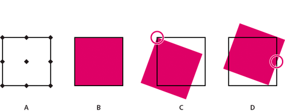

# FXG-serverprotocol{#fxg-server-protocol}

Als u een afbeelding wilt bewerken, kunt u referentiepunten gebruiken die vergelijkbaar zijn met kompaspunten.

Met behulp van referentiepunten kunt u een afbeelding roteren, schalen of de grootte ervan wijzigen ten opzichte van een bepaald referentiepunt. De referentiepunten zijn `northWest`, `north`, `northEast`, `west`, `center`, `east`, `southWest`, `south`, en `southeast`. Als u bijvoorbeeld het middelste referentiepunt gebruikt, kunt u een afbeelding 45° roteren in het midden. In de volgende afbeelding ziet u waar de referentiepunten zich bevinden, een afbeelding die 20° van de referentiepunten is geroteerd `northWest` referentiepunt en de afbeelding is 20° gedraaid ten opzichte van het referentiepunt `east` referentiepunt.

* A. Locatie referentiepunt
* B. Een afbeelding
* C. De afbeelding is 20° gedraaid ten opzichte van de afbeelding `northWest` referentiepunt
* D. De afbeelding is 20° geroteerd ten opzichte van het `east` referentiepunt

De syntaxis is:

`referencePoint <string> (northWest, north, northEast, west, center, east, southWest, south, southEast, none, inherit)`

De standaardwaarde is geen. De `inherit` de waarde doorgeeft `s7:referencePoint` waarde, op voorwaarde dat `none`, vanaf de bovenkant van de pagina of het groepsniveau tot alle onderliggende items. De `none` instelling betekent dat er geen referentiepunt is voor het object en dat het FXG-coördinatensysteem wordt gebruikt.

>[!NOTE]
>
>Als u een referentiepunt wilt gebruiken en geen verschuiving in het object wilt toepassen nadat het is gemanipuleerd, werkt u de x- en y-waarden van het object bij nadat u het hebt bewerkt.

Wanneer een waarde van `s7:referencePoint` Deze waarde wordt gebruikt bij groepen (of paden, lijnelementen of elementen zonder expliciete breedte- en hoogtedefinities) en is van toepassing op het cumulatieve selectiekader van de groep. Het punt linksboven van het selectiekader van alle objecten in de groep fungeert bijvoorbeeld als de `northWest` referentiepunt voor de groep; het punt rechtsonder dient als de `southEast` referentiepunt.
