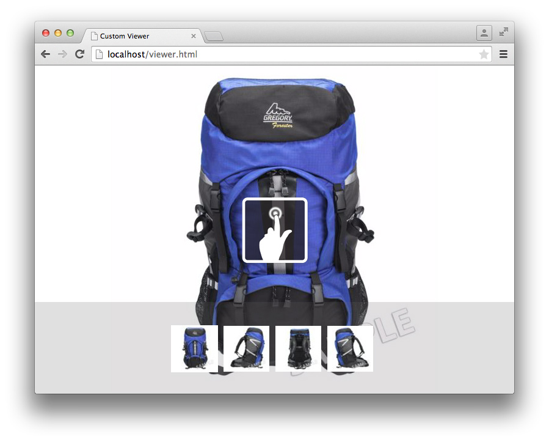

# Zelfstudie voor viewer-SDK{#viewer-sdk-tutorial}

De Viewer SDK bevat een set JavaScript-componenten voor de ontwikkeling van aangepaste viewers. De viewers zijn webtoepassingen waarmee rijke media-inhoud van Adobe Scene7 kan worden ingesloten in webpagina&#39;s.

De SDK biedt bijvoorbeeld interactief zoomen en pannen. Het verstrekt ook mening 360° en videoplayback van activa die aan Adobe Scene7 door de achterste toepassing genoemd SPS (het Publiceren Scene7 Systeem) werden geupload.

Hoewel de componenten afhankelijk zijn van HTML5-functionaliteit, zijn ze ontworpen voor gebruik op Android- en Apple iOS-apparaten en desktops, waaronder Internet Explorer en hoger. Dit soort ervaring betekent dat u één workflow kunt bieden voor alle ondersteunde platforms.

De SDK bestaat uit UI-componenten waaruit viewerinhoud bestaat. U kunt deze componenten opmaken via CSS en niet-UI-componenten die een ondersteunende rol hebben, zoals het ophalen en parseren of bijhouden van definities. Alle componentgedragingen zijn aanpasbaar via wijzigingstoetsen die u op verschillende manieren kunt opgeven, bijvoorbeeld als `name=value` paren in de URL.

Deze zelfstudie bevat de volgende taakvolgorde om u te helpen een standaardzoomviewer te maken:

* [Download de nieuwste Viewer SDK via Adobe Developer Connection](c-tutorial.md#section-84dc74c9d8e24a2380b6cf8fc28d7127)
* [De SDK van de viewer laden](c-tutorial.md#section-98596c276faf4cf79ccf558a9f4432c6)
* [Stijl toevoegen aan uw viewer](c-tutorial.md#section-3783125360a1425eae5a5a334867cc32)
* [Inclusief container en ZoomView](c-tutorial.md#section-1a01730663154a508b88cc40c6f35539)
* [Componenten MediaSet en Stalen toevoegen aan uw viewer](c-tutorial.md#section-02b8c21dd842400e83eae2a48ec265b7)
* [Knoppen toevoegen aan uw viewer](c-tutorial.md#section-1fc334fa0d2b47eb9cdad461725c07be)
* [De stalen verticaal configureren](c-tutorial.md#section-91a8829d5b5a4d45a35b7faeb097fcc9)

## Download de nieuwste Viewer SDK via Adobe Developer Connection {#section-84dc74c9d8e24a2380b6cf8fc28d7127}

1. Download de nieuwste Viewer SDK van Adobe Developer Connection [hier](https://marketing.adobe.com/developer/devcenter/scene7/show).

   >[!NOTE]
   >
   >U kunt deze zelfstudie voltooien zonder dat u het pakket met de Viewer SDK hoeft te downloaden omdat de SDK daadwerkelijk op afstand is geladen. Het Viewer-pakket bevat echter aanvullende voorbeelden en een API-naslaggids die u kunt gebruiken wanneer u uw eigen viewers maakt.

## De SDK van de viewer laden {#section-98596c276faf4cf79ccf558a9f4432c6}

1. Maak eerst een nieuwe pagina voor de ontwikkeling van de standaardzoomviewer die u gaat maken.

   Overweeg dit de bootstrap-of lader-code aan opstelling een lege toepassing van SDK. Open uw favoriete teksteditor en plak de volgende HTML-opmaak in deze editor:

   ```
   <!DOCTYPE html> 
   <html> 
       <head> 
           <meta http-equiv="Content-Type" content="text/html; charset=utf-8" /> 
           <meta name="viewport" content="user-scalable=no, height=device-height, width=device-width, initial-scale=1.0, maximum-scale=1.0"/> 
   
           <!-- Hiding the Safari on iPhone OS UI components --> 
           <meta name="apple-mobile-web-app-capable" content="yes"/> 
           <meta name="apple-mobile-web-app-status-bar-style" content="black"/> 
           <meta name="apple-touch-fullscreen" content="no"/> 
   
           <title>Custom Viewer</title> 
   
           <!-- 
               Include Utils.js before you use any of the SDK components. This file  
               contains SDK utilities and global functions that are used to initialize the viewer and load viewer  
               components. The path to the Utils.js determines which version of the SDK that the viewer uses. You  
               can use a relative path if the viewer is deployed on one of the Adobe Scene7 servers and it is served  
               from the same domain. Otherwise, specify a full path to one of Adobe Scene7 servers that have the SDK  
               installed.  
           --> 
           <script language="javascript" type="text/javascript"      
                   src="http://s7d1.scene7.com/s7sdk/2.8/js/s7sdk/utils/Utils.js"></script> 
   
       </head> 
       <body> 
           <script language="javascript" type="text/javascript"> 
           </script>  
       </body> 
   </html>
   ```

   Voeg de volgende JavaScript-code in de `script` tag toe om de `ParameterManager`tag te initialiseren. Dit helpt u zich voorbereiden om componenten van SDK binnen de `initViewer` functie tot stand te brengen en te concretiseren:

   ```
   /* We create a self-running anonymous function to encapsulate variable scope. Placing code inside such 
      a function is optional, but this prevents variables from polluting the global object.  */ 
   (function () { 
   
       // Initialize the SDK   
       s7sdk.Util.init(); 
   
       /* Create an instance of the ParameterManager component to collect components' configuration 
          that can come from a viewer preset, URL, or the HTML page itself. The ParameterManager  
          component also sends a notification s7sdk.Event.SDK_READY when all needed files are loaded 
          and the configuration parameters are processed. The other components should never be initialized 
          outside this handler. After defining the handler for the s7sdk.Event.SDK_READY event, it 
          is safe to initiate configuration initialization by calling ParameterManager.init(). */ 
       var params = new s7sdk.ParameterManager(); 
   
       /* Event handler for s7sdk.Event.SDK_READY dispatched by ParameterManager to initialize various components of  
          this viewer. */ 
       function initViewer() { 
   
       }  
   
       /* Add event handler for the s7sdk.Event.SDK_READY event dispatched by the ParameterManager when all modifiers 
          are processed and it is safe to initialize the viewer. */ 
       params.addEventListener(s7sdk.Event.SDK_READY, initViewer, false); 
   
       /* Initiate configuration initialization of ParameterManager. */ 
       params.init(); 
   
   }());
   ```

1. Sla het bestand op als een lege sjabloon. U kunt elke gewenste bestandsnaam gebruiken.

   U gebruikt dit lege sjabloonbestand als referentie bij het maken van nieuwe viewers in de toekomst. Deze sjabloon werkt lokaal en vanaf een webserver.

U voegt nu stijl toe aan uw viewer.

## Stijl toevoegen aan uw viewer {#section-3783125360a1425eae5a5a334867cc32}

1. Voor deze viewer voor volledige pagina&#39;s die u maakt, kunt u enkele basisstijlen toevoegen.

   Voeg het volgende `style` blok aan de bodem van toe `head`:

   ```
   <style> 
       html, body { 
           width: 100%; 
           height: 100%; 
       } 
       body { 
           /* Remove any padding and margin around the edges of the browser window */ 
           padding: 0; 
           margin: 0; 
   
           /* We set overflow to hidden so that scroll bars do not flicker when resizing the window */ 
           overflow: hidden; 
       } 
   </style>
   ```

U neemt nu de componenten `Container` en `ZoomView`.

## Inclusief container en ZoomView {#section-1a01730663154a508b88cc40c6f35539}

1. Maak een werkelijke viewer door de componenten `Container` en `ZoomView`.

   Voeg de volgende `include` instructies onder aan het `<head>` element in, nadat het [!DNL Utils.js] script is geladen:

   ```
   <!-- 
       Add an "include" statement with a related module for each component that is needed for that particular  
       viewer. Check API documentation to see a complete list of components and their modules. 
   --> 
   <script language="javascript" type="text/javascript"> 
       s7sdk.Util.lib.include('s7sdk.common.Container');  
       s7sdk.Util.lib.include('s7sdk.image.ZoomView');  
   </script>
   ```

1. Maak nu variabelen om te verwijzen naar de verschillende SDK-componenten.

   Voeg de volgende variabelen aan de bovenkant van de belangrijkste anonieme functie, enkel hierboven toe `s7sdk.Util.init()`:

   ```
   var container, zoomView;
   ```

1. Voeg het volgende in de `initViewer` functie in om sommige modifiers te definiëren en de respectievelijke componenten te instantiëren:

   ```
   /* Modifiers can be added directly to ParameterManager instance */ 
   params.push("serverurl", "http://s7d1.scene7.com/is/image"); 
   params.push("asset", "Scene7SharedAssets/ImageSet-Views-Sample"); 
   
   /* Create a viewer container as a parent component for other user interface components that  
      are part of the viewer application and associate event handlers for resize and  
      full screen notification. The advantage of using Container as the parent is the  
      component's ability to resize and bring itself and its children to full screen. */ 
   container = new s7sdk.common.Container(null, params, "s7container"); 
   container.addEventListener(s7sdk.event.ResizeEvent.COMPONENT_RESIZE, containerResize, false); 
   
   /* Create ZoomView component */ 
   zoomView = new s7sdk.image.ZoomView("s7container", params, "myZoomView");  
   
   /* We call this to ensure all SDK components are scaled to initial conditions when viewer loads */ 
   resizeViewer(container.getWidth(), container.getHeight());
   ```

1. Voeg een `containerResize` gebeurtenishandler en een hulplijnfunctie toe voor een correcte uitvoering van de bovenstaande code:

   ```
   /* Event handler for s7sdk.event.ResizeEvent.COMPONENT_RESIZE events dispatched by Container to resize 
      various view components included in this viewer. */ 
   function containerResize(event) { 
       resizeViewer(event.s7event.w, event.s7event.h); 
   } 
   
   /* Resize viewer components */ 
   function resizeViewer(width, height) { 
       zoomView.resize(width, height); 
   }
   ```

1. Geef een voorvertoning van de pagina weer, zodat u kunt zien wat u hebt gemaakt. De pagina ziet er als volgt uit:

   

U voegt nu de componenten `MediaSet` en `Swatches` aan uw viewer toe.

## Componenten MediaSet en Stalen toevoegen aan uw viewer {#section-02b8c21dd842400e83eae2a48ec265b7}

1. Als u gebruikers de mogelijkheid wilt geven om afbeeldingen uit een set te selecteren, kunt u de componenten `MediaSet` en `Swatches`componenten toevoegen.

   Voeg de volgende SDK toe:

   ```
   s7sdk.Util.lib.include('s7sdk.set.MediaSet'); 
   s7sdk.Util.lib.include('s7sdk.set.Swatches');
   ```

1. Werk de lijst met variabelen als volgt bij:

   ```
   var mediaSet, container, zoomView, swatches;
   ```

1. Instantiëren `MediaSet` en `Swatches` componenten binnen de `initViewer` functie.

   Instantieer de `Swatches` instantie na de `ZoomView` en `Container` componenten, anders verbergt de stapelvolgorde het `Swatches`:

   ```
   // Create MediaSet to manage assets and add event listener to the NOTF_SET_PARSED event 
   mediaSet = new s7sdk.set.MediaSet(null, params, "mediaSet"); 
   
   // Add MediaSet event listener 
   mediaSet.addEventListener(s7sdk.event.AssetEvent.NOTF_SET_PARSED, onSetParsed, false); 
   
   /* create Swatches component and associate event handler for swatch selection notification */ 
   swatches = new s7sdk.set.Swatches("s7container", params, "mySwatches");   
   swatches.addEventListener(s7sdk.event.AssetEvent.SWATCH_SELECTED_EVENT, swatchSelected, false);
   ```

1. Voeg nu de volgende gebeurtenishandlerfuncties toe:

   ```
   /* Event handler for the s7sdk.event.AssetEvent.NOTF_SET_PARSED event dispatched by MediaSet to 
      assign the asset to the Swatches when parsing is complete. */ 
   function onSetParsed(e) { 
   
       // set media set for Swatches to display  
       var mediasetDesc = e.s7event.asset;  
       swatches.setMediaSet(mediasetDesc); 
   
       // select the first swatch by default  
       swatches.selectSwatch(0, true);      
   } 
   
   /* Event handler for s7sdk.event.AssetEvent.SWATCH_SELECTED_EVENT events dispatched by Swatches to switch 
      the image in the ZoomView when a different swatch is selected. */ 
   function swatchSelected(event) {     
       zoomView.setItem(event.s7event.asset);  
   }
   ```

1. Plaats de stalen onder aan de viewer door de volgende CSS aan het `style` element toe te voegen:

   ```
   /* Align swatches to bottom of viewer */ 
   .s7swatches { 
       bottom: 0; 
       left: 0; 
       right: 0; 
       height: 150px; 
   }
   ```

1. Geef een voorvertoning van uw viewer weer.

   De stalen bevinden zich linksonder in de viewer. Als u wilt dat de stalen de volledige viewerbreedte beslaan, voegt u een aanroep toe om de stalen handmatig te vergroten of te verkleinen wanneer de gebruiker de grootte van de browser wijzigt. Voeg het volgende toe aan de `resizeViewer` functie:

   ```
   swatches.resize(width, swatches.getHeight());
   ```

   De viewer ziet er nu uit als de volgende afbeelding. Probeer het browservenster van de viewer aan te passen en bekijk het gedrag.

   

U voegt nu knoppen voor inzoomen, uitzoomen en het opnieuw instellen van zoomen toe aan uw viewer.

## Knoppen toevoegen aan uw viewer {#section-1fc334fa0d2b47eb9cdad461725c07be}

1. Op dit moment kan de gebruiker alleen zoomen met klik- of aanraakbewegingen. Voeg daarom enkele standaardknoppen voor zoomknoppen toe aan de viewer.

   Voeg de volgende knopcomponenten toe:

   ```
   s7sdk.Util.lib.include('s7sdk.common.Button');
   ```

1. Werk de lijst met variabelen als volgt bij:

   ```
   var mediaSet, container, zoomView, swatches, zoomInButton, zoomOutButton, zoomResetButton;
   ```

1. Instantiëren van knoppen onder aan `initViewer` functie.

   Onthoud dat de volgorde van belang is, tenzij u de volgorde opgeeft `z-index` in CSS:

   ```
   /* Create Zoom In, Zoom Out and Zoom Reset buttons */ 
   zoomInButton  = new s7sdk.common.ZoomInButton("s7container", params, "zoomInBtn"); 
   zoomOutButton = new s7sdk.common.ZoomOutButton("s7container", params, "zoomOutBtn"); 
   zoomResetButton = new s7sdk.common.ZoomResetButton("s7container", params, "zoomResetBtn"); 
   
   /* Add handlers for zoom in, zoom out and zoom reset buttons inline. */ 
   zoomInButton.addEventListener("click", function() { zoomView.zoomIn(); }); 
   zoomOutButton.addEventListener("click", function() { zoomView.zoomOut(); }); 
   zoomResetButton.addEventListener("click", function() { zoomView.zoomReset(); });
   ```

1. Definieer nu enkele basisstijlen voor de knoppen door het volgende toe te voegen aan het `style` blok boven aan het bestand:

   ```
   /* define styles common to all button components and their sub-classes */ 
   .s7button { 
       position:absolute; 
       width: 28px; 
       height: 28px; 
       z-index:100; 
   } 
   
   /* position individual buttons*/ 
   .s7zoominbutton  { 
       top: 50px; 
       left: 50px; 
    } 
   .s7zoomoutbutton  { 
       top: 50px; 
       left: 80px; 
    } 
   .s7zoomresetbutton  { 
       top: 50px; 
       left: 110px; 
    }
   ```

1. Geef een voorvertoning van uw viewer weer. Het ziet er als volgt uit:

   

   U configureert de stalen nu zodanig dat deze verticaal aan de rechterkant worden uitgelijnd.

## De stalen verticaal configureren {#section-91a8829d5b5a4d45a35b7faeb097fcc9}

1. U kunt modifiers direct op de `ParameterManager` instantie vormen.

   Voeg het volgende aan de bovenkant van de `initViewer` functie toe om de `Swatches` duimlay-out als één enkele rij te vormen:

   ```
   params.push("Swatches.tmblayout", "1,0");
   ```

1. Werk volgende resize vraag binnen bij `resizeViewer`:

   ```
   swatches.resize(swatches.getWidth(), height);
   ```

1. Bewerk de volgende `s7swatches` regel in `ZoomViewer.css`:

   ```
   .s7swatches { 
       top:0 ; 
       bottom: 0; 
       right: 0; 
       width: 150px; 
   }
   ```

1. Geef een voorvertoning van uw viewer weer. Het ziet er als volgt uit:

   

   Uw standaardzoomviewer is nu voltooid.

   Deze viewerzelfstudie raakt de grondbeginselen van wat de Scene7 Viewer SDK biedt. Terwijl u met de SDK werkt, kunt u de verschillende standaardcomponenten gebruiken om eenvoudig rijke kijkervaringen voor uw doelpubliek te maken en te stijlaliseren.

